This is a [Next.js](https://nextjs.org/) project bootstrapped with [`create-next-app`](https://github.com/vercel/next.js/tree/canary/packages/create-next-app).

## Getting Started

First, copy .env.example

```bash
cp .env.example .env
```

**Then, make sure you have filled `.env` properly with needed vars.**

And then run development server:

```bash
npm run dev
```

Open [http://localhost:3000](http://localhost:3000) with your browser to see the result.

## This application uses a bunch of tools

- [Supabase](https://supabase.com/)
- [Stripe](https://stripe.com/br)

## The proposal

### Landing page

A landing page presenting the platform

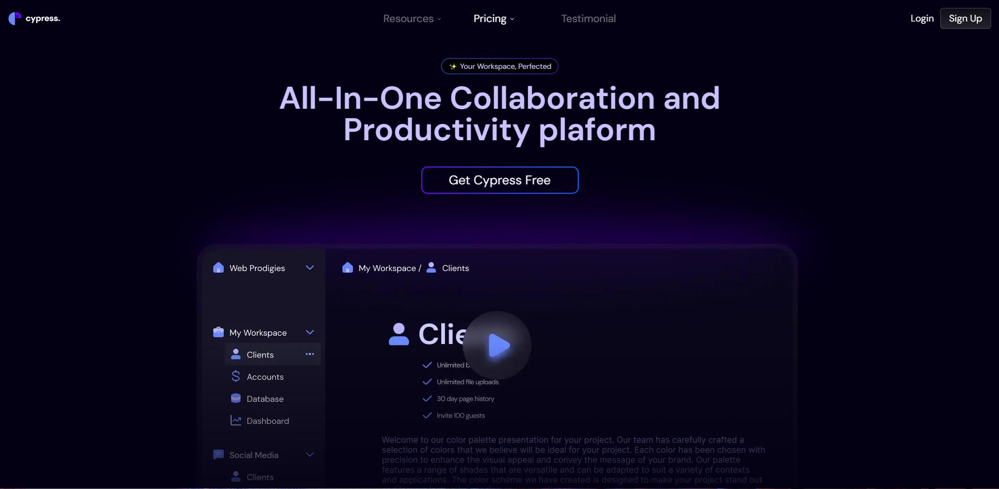
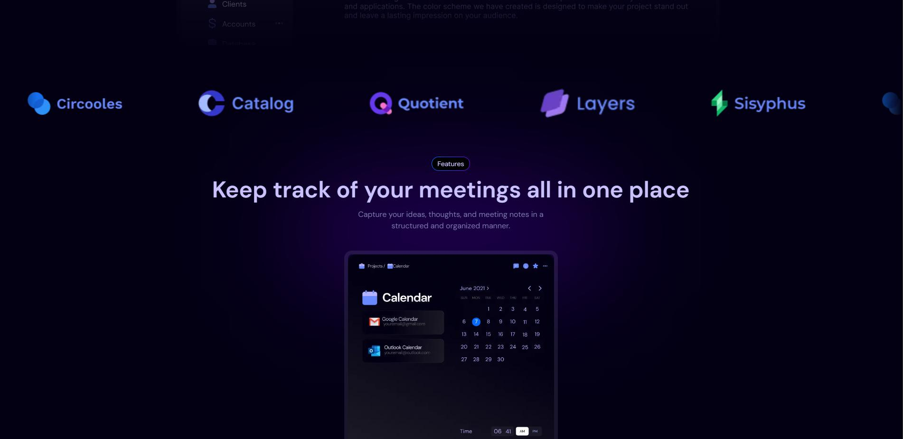
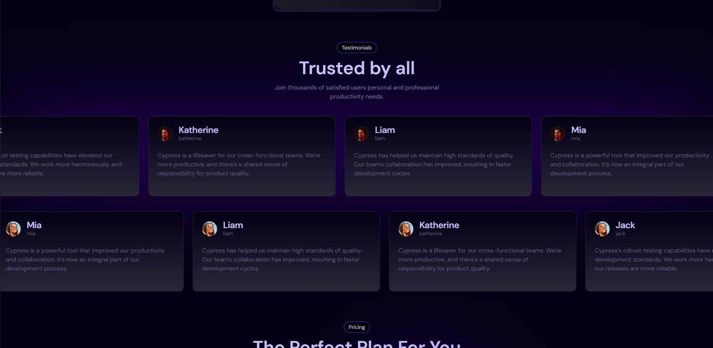


### Sign up

A sign up page, to create an account on the platform

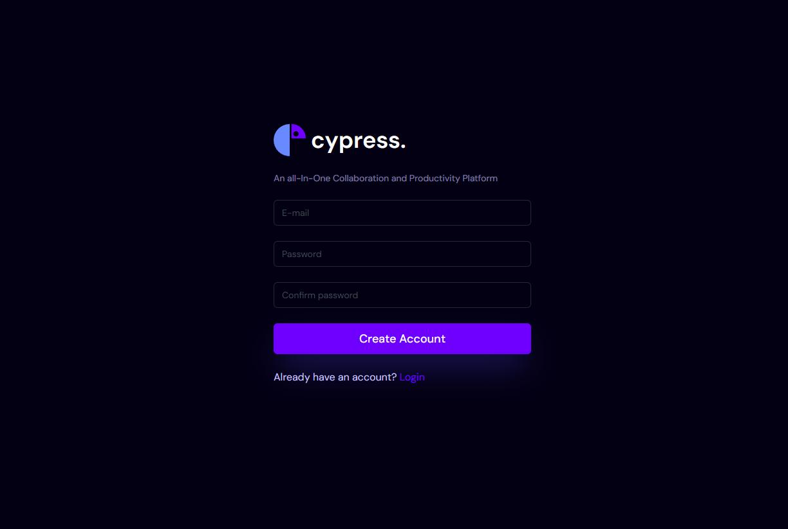

### Login

A login page, to access the platform

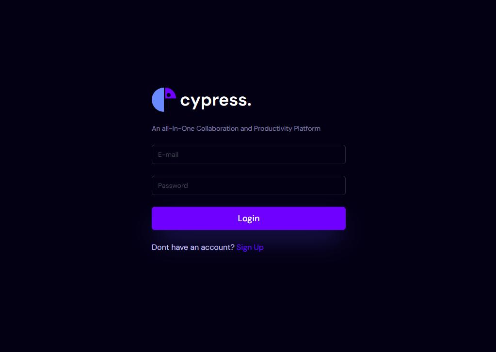

### Dashboard

A dashboard, to manage the workspaces

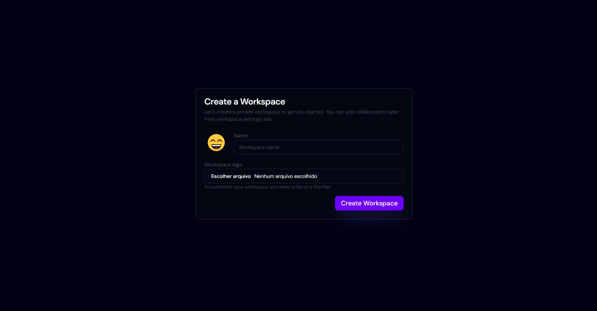

### Workspace

Inside workspace you have three levels of editor

1. Workspace editor
2. Folder editor
3. File editor

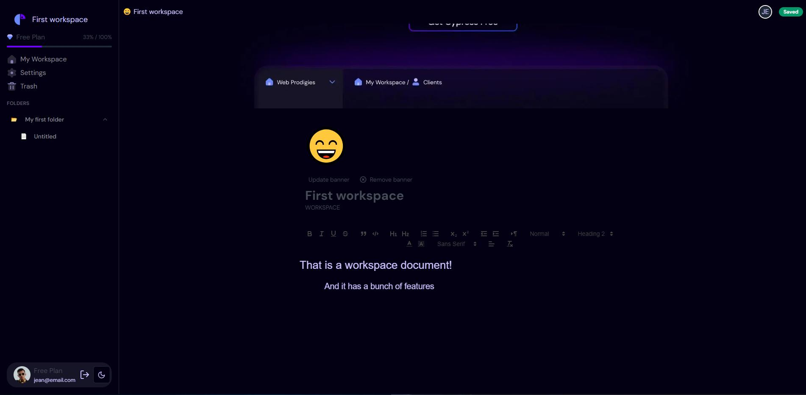

### Trash management

You can move files or folders to trash.

You can undo it or delete completly

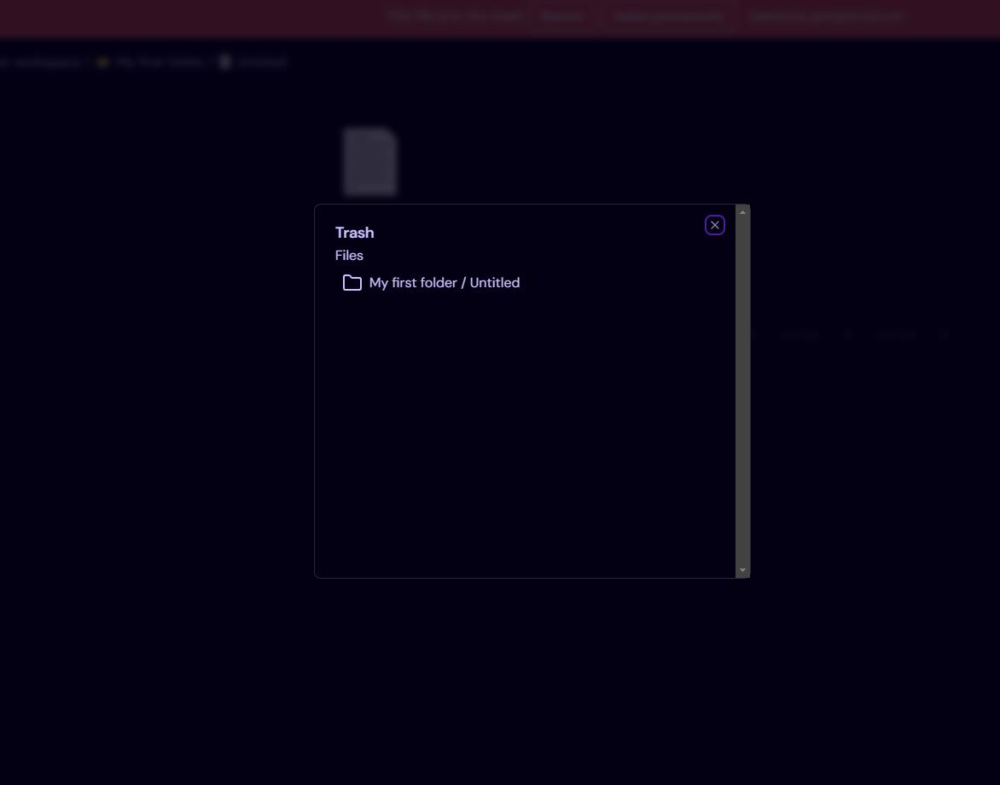
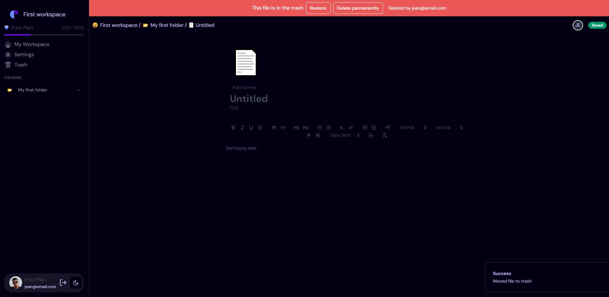

### Share your workspaces

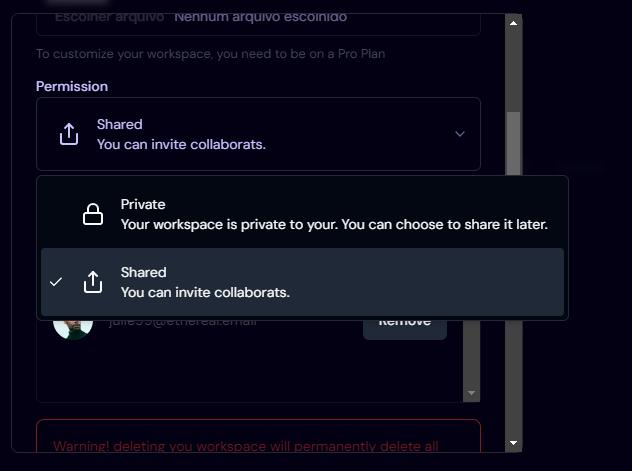

Search your friends and share your workspace with them

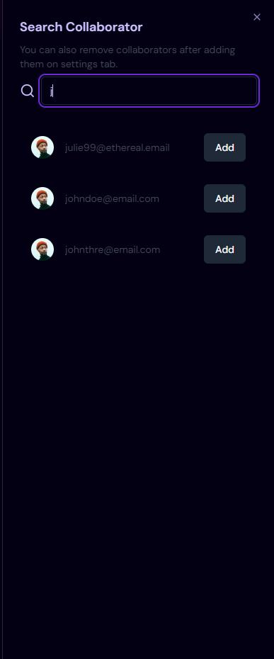

Do it with realtime collaboratino

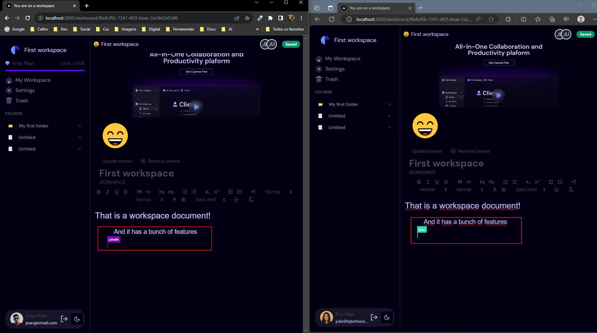

### Start your subscription securely with Stripe

You can upgrade your workspaces with a level up subscription

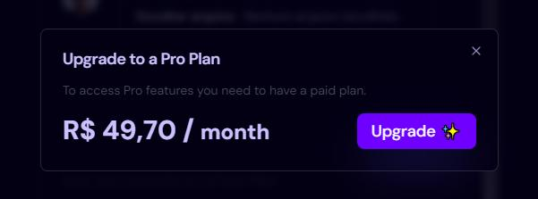

The payment is processed by stripe!

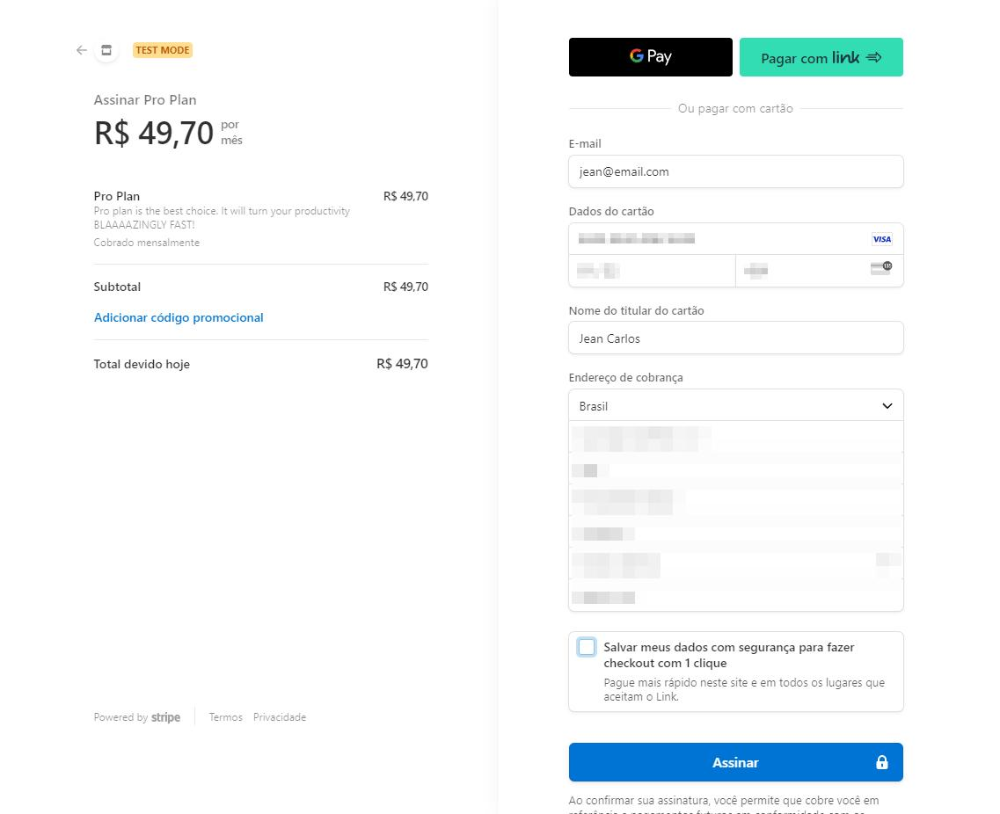

### Alterante between white and dark colors

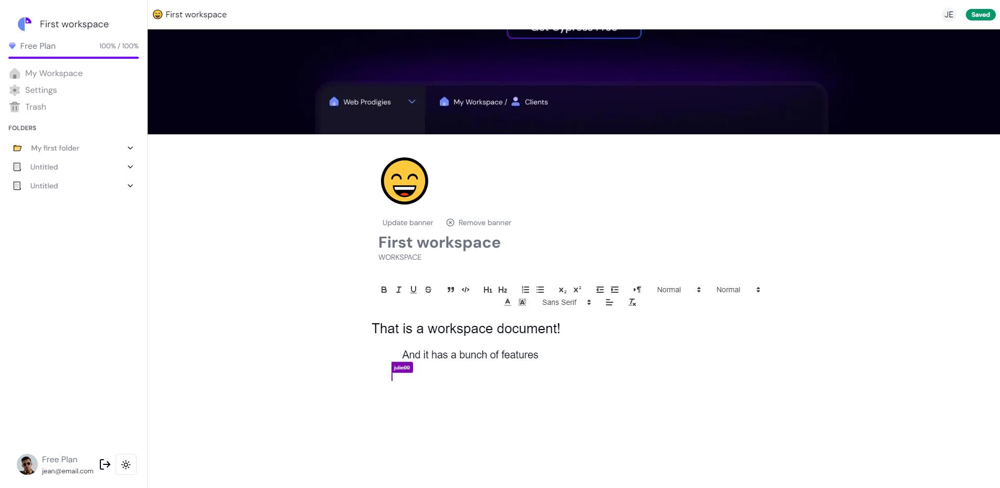
